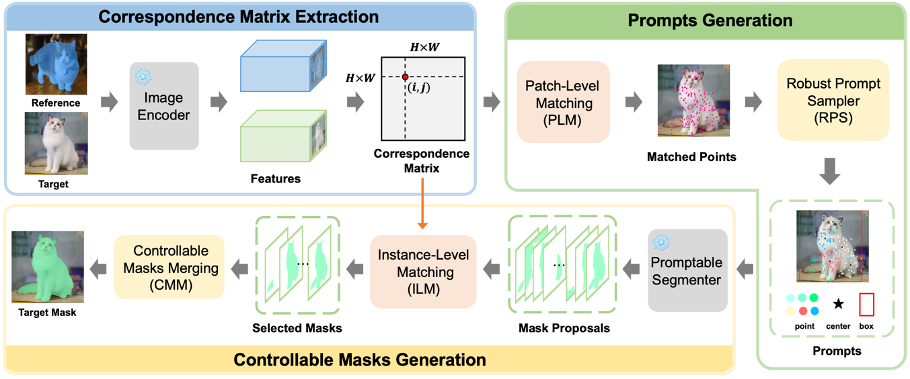
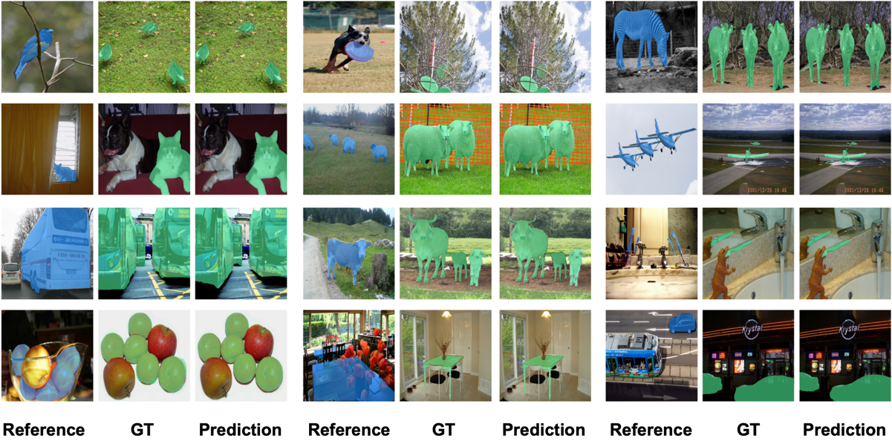
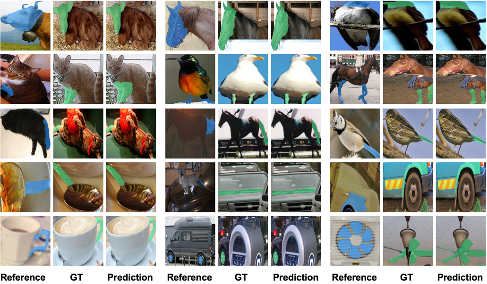
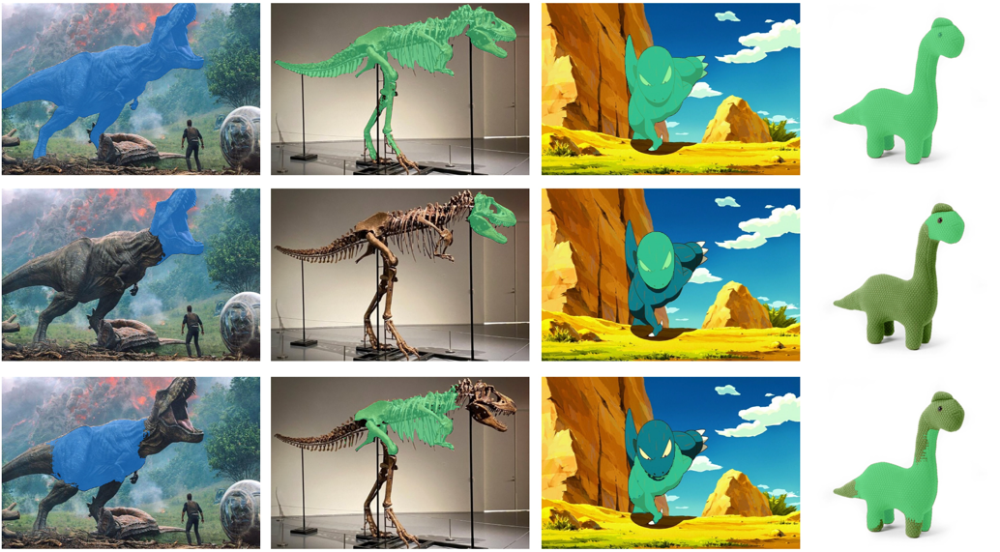

<div align="center">

<h1>Matcher: Segment Anything with One Shot Using All-Purpose Feature Matching </h1>

[Yang Liu](https://scholar.google.com/citations?user=9JcQ2hwAAAAJ&hl=en)<sup>1*</sup>, &nbsp; 
[Muzhi Zhu](https://scholar.google.com/citations?user=064gBH4AAAAJ&hl=en)<sup>1*</sup>, &nbsp; 
Hengtao Li<sup>1*</sup>, &nbsp;
[Hao Chen](https://stan-haochen.github.io/)<sup>1</sup>, &nbsp;
[Xinlong Wang](https://www.xloong.wang/)<sup>2</sup>, &nbsp;
[Chunhua Shen](https://cshen.github.io/)<sup>1</sup>

<sup>1</sup>[Zhejiang University](https://www.zju.edu.cn/english/), &nbsp;
<sup>2</sup>[Beijing Academy of Artificial Intelligence](https://www.baai.ac.cn/english.html)

ICLR 2024

</div>

## 🚀 Overview
<div align="center">

</div>

## 📖 Description


Powered by large-scale pre-training, vision foundation models exhibit significant potential in open-world image understanding. However, unlike large language models that excel at directly 
tackling various language tasks, vision foundation models require a task-specific model structure followed by fine-tuning on specific tasks. In this work, we present **Matcher**, 
a novel perception paradigm that utilizes off-the-shelf vision foundation models to address various perception tasks. Matcher can segment anything by using an in-context example without training. 
Additionally, we design three effective components within the Matcher framework to collaborate with these foundation models and unleash their full potential in diverse perception tasks. 
Matcher demonstrates impressive generalization performance across various segmentation tasks, all without training. Our visualization results further showcase the open-world generality and flexibility of Matcher when applied to images in the wild.

[Paper](https://arxiv.org/abs/2305.13310)

## ℹ️ News

- 2024.1 Matcher has been accepted to ICLR 2024!
- 2024.1 Matcher supports [Semantic-SAM](https://github.com/UX-Decoder/Semantic-SAM) for better part segmentation.
- 2024.1 We provide a Gradio Demo.
- 2024.1 Release code of one-shot semantic segmentation and one-shot part segmentation tasks.


## 🗓️ TODO
- [x] Gradio Demo 
- [x] Release code of one-shot semantic segmentation and one-shot part segmentation tasks
- [ ] Release code and models for VOS


## 🏗️ Installation

See [installation instructions](INSTALL.md).

## 👻 Getting Started

See [Preparing Datasets for Matcher](datasets/README.md).

See [Getting Started with Matcher](GETTING_STARTED.md).


## 🖼️ Demo

### One-Shot Semantic Segmantation

<div align="center">

</div>

### One-Shot Object Part Segmantation

<div align="center">

</div>

### Cross-Style Object and Object Part Segmentation

<div align="center">

</div>

### Controllable Mask Output

<div align="center">

</div>


### Video Object Segmentation

https://github.com/aim-uofa/Matcher/assets/119775808/9ff9502d-7d2a-43bc-a8ef-01235097d62b


## 🎫 License

For academic use, this project is licensed under [the 2-clause BSD License](https://opensource.org/license/bsd-2-clause). 
For commercial use, please contact [Chunhua Shen](mailto:chhshen@gmail.com).


## 🖊️ Citation


If you find this project useful in your research, please consider to cite:


```BibTeX
@article{liu2023matcher,
  title={Matcher: Segment Anything with One Shot Using All-Purpose Feature Matching},
  author={Liu, Yang and Zhu, Muzhi and Li, Hengtao and Chen, Hao and Wang, Xinlong and Shen, Chunhua},
  journal={arXiv preprint arXiv:2305.13310},
  year={2023}
}
```

## Acknowledgement
[SAM](https://github.com/facebookresearch/segment-anything), [DINOv2](https://github.com/facebookresearch/dinov2), [SegGPT](https://github.com/baaivision/Painter/tree/main/SegGPT), [HSNet](https://github.com/juhongm999/hsnet), [Semantic-SAM](https://github.com/UX-Decoder/Semantic-SAM) and [detectron2](https://github.com/facebookresearch/detectron2).
